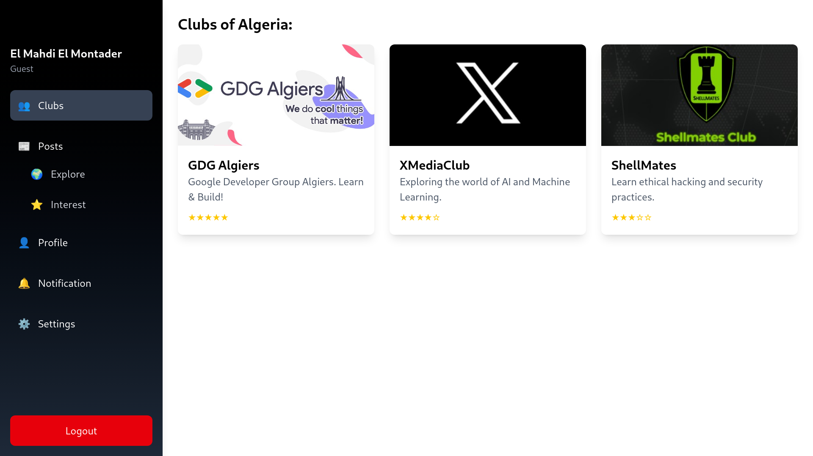
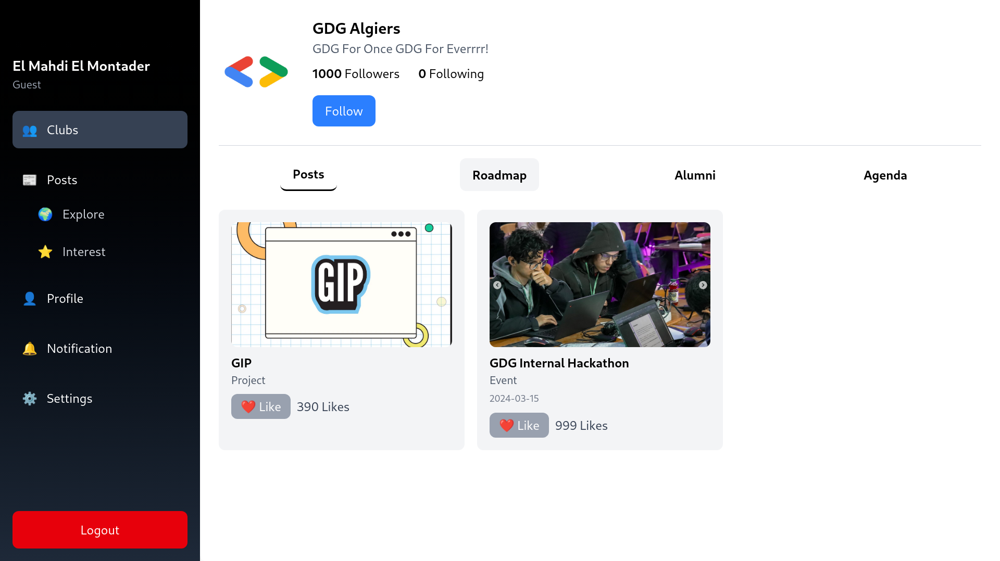
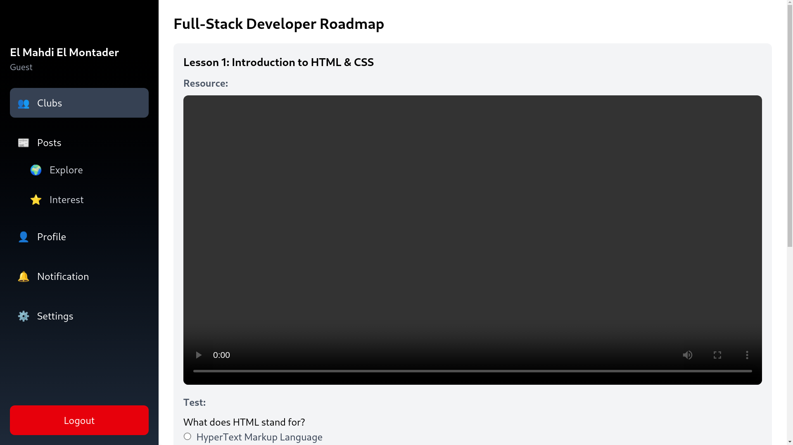
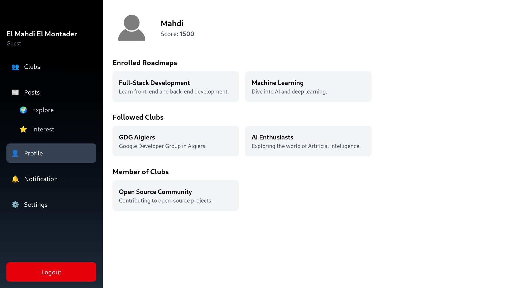
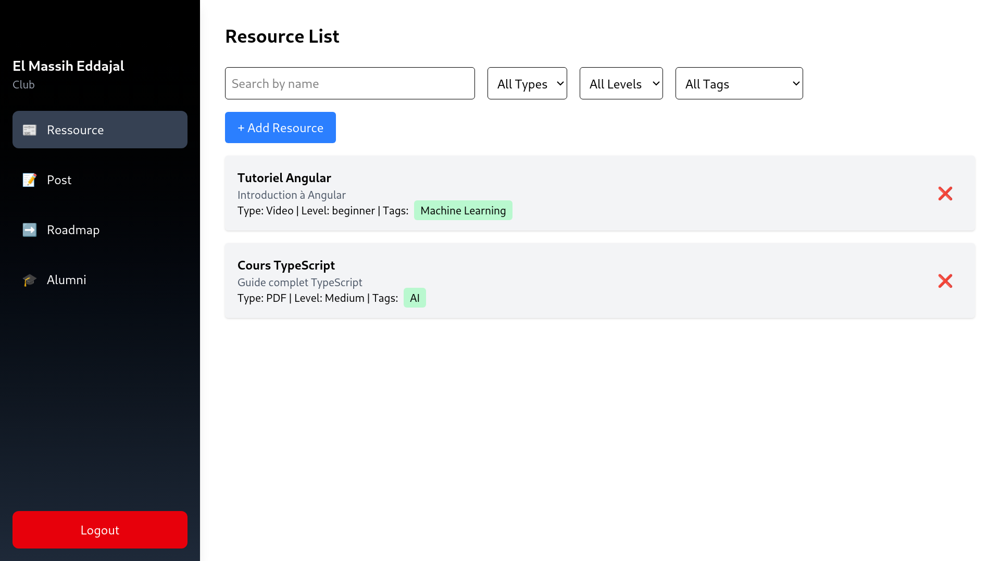
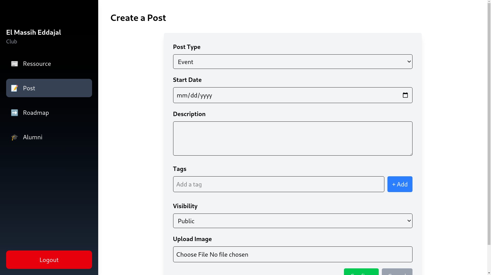

# ClubsVerse

## Overview
Clubs Verse is a centralized platform for **scientific clubs in Algeria** to share **free courses, events, projects, and alumni contacts** without social media distractions. Users can **discover and rank clubs (0-5 stars)** based on engagement, ensuring visibility for high-quality content, even from smaller clubs. The platform fosters **learning and collaboration** in the scientific community. 
The idea of this porject cames from GDG Hackathon 2025.

##  Key Features
- **Structured & Distraction-Free:** No reels, memes, or unrelated content.  
- **Scientific Club Rankings (0-5 Stars):** Quality-based ranking, not followers, it helps small clubs to grow.
- **AI-Powered Recommendations:** Personalized course & club suggestions.
- **AI-Generated Course Roadmaps:** Roadmaps for courses are created using AI, based on club resources.

## Technologies used:
Angular, Django, Tailwind and PostgreSQL